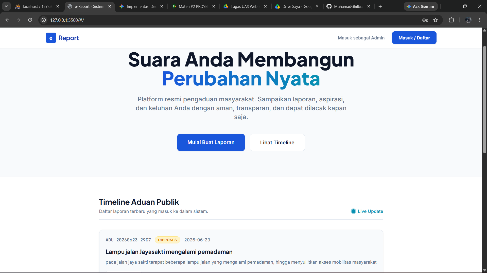
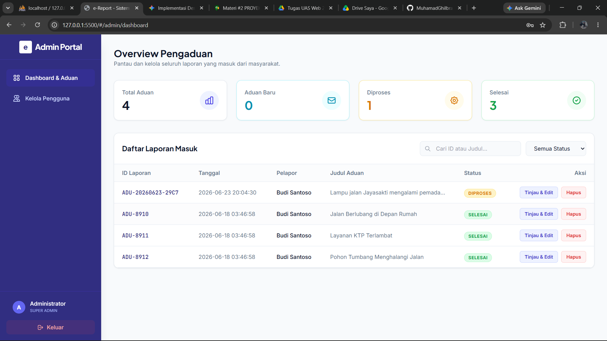
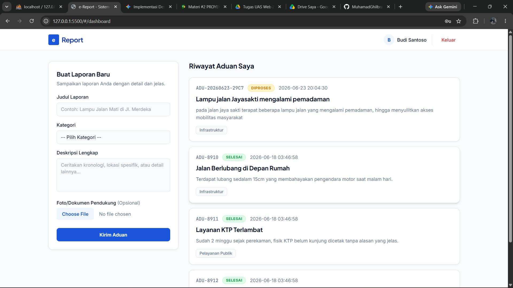
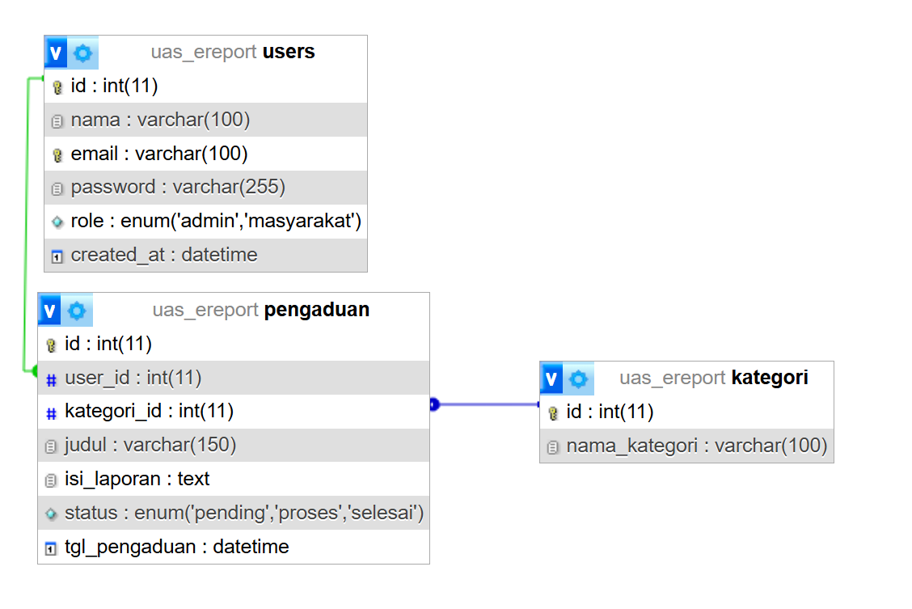
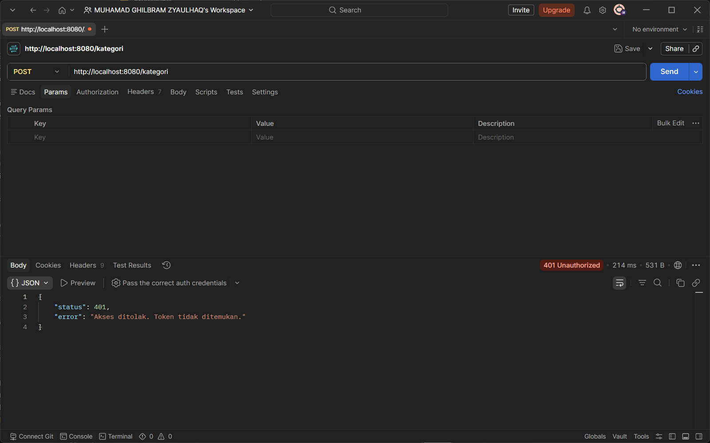

# 📢 e-Report: Sistem Layanan Pengaduan Masyarakat

e-Report adalah aplikasi *Full-Stack* berbasis web yang dirancang untuk memfasilitasi pelaporan keluhan dan aspirasi masyarakat secara transparan, aman, dan *real-time*. Dilengkapi dengan sistem autentikasi modern dan dasbor administrator interaktif.

## ✨ Fitur Utama
### 📸 Antarmuka Pengguna (UI)
*(Tampilan antarmuka aplikasi e-Report)*

**1. Halaman Utama & Timeline Publik**


**2. Dashboard Administrator**


**3. Portal Pelaporan Masyarakat**


---

### 🗄️ Arsitektur & Pengujian Backend

**1. Skema Relasi Database (ERD)**
Struktur database relasional yang menghubungkan entitas pengguna, kategori, dan detail pengaduan.


**2. Keamanan & Pengujian API (Postman)**
Pengujian *endpoint* RESTful API yang dilindungi oleh autentikasi JSON Web Token (JWT).


---

### 👥 Modul Masyarakat (Public)
* **Autentikasi Aman:** Registrasi dan Login menggunakan sistem *JSON Web Token* (JWT).
* **Timeline Publik:** Menampilkan aduan terbaru secara langsung dari database tanpa perlu login.
* **Kirim Laporan & Lampiran:** Masyarakat dapat membuat aduan baru yang dilengkapi dengan bukti foto otentik di lapangan.
* **Riwayat Personal:** Melacak status laporan pribadi (Menunggu, Diproses, Selesai, Ditolak).

### 🛡️ Modul Administrator
* **Dashboard Statistik:** Ringkasan jumlah aduan berdasarkan status penanganan.
* **Manajemen Laporan:** Fitur peninjauan laporan, pengubahan status laporan (via *Modal Pop-up*), dan penghapusan data.
* **Manajemen Pengguna (RBAC):** Menambahkan admin baru atau menghapus akun masyarakat yang melanggar ketentuan.
* **Preview Lampiran:** Melihat langsung bukti foto yang diunggah oleh masyarakat.

---

## 🛠️ Teknologi yang Digunakan

* **Frontend:** Vue.js 3 (Composition API), Tailwind CSS, Axios, Vue Router.
* **Backend:** CodeIgniter 4 (RESTful API).
* **Database:** MySQL.
* **Keamanan:** JWT (JSON Web Token), Password Hashing (Bcrypt).

---

## 🚀 Panduan Instalasi (Setup Lokal)

Ikuti langkah-langkah berikut untuk menjalankan aplikasi ini di komputer lokal Anda:

### 1. Persiapan Database
1. Buka phpMyAdmin, buat database baru dengan nama `pengaduan_db`.
2. *Import* file `pengaduan_db.sql` (jika ada) atau pastikan tabel `users` dan `pengaduan` sudah terbuat.

### 2. Setup Backend (CodeIgniter 4)
1. Buka terminal dan arahkan ke folder `backend`.
2. Jalankan perintah `composer install` untuk mengunduh dependensi (termasuk *library* Firebase JWT).
3. Ubah nama file `env` menjadi `.env`.
4. Buka file `.env` dan konfigurasikan bagian berikut:
   ```env
   CI_ENVIRONMENT = development

   # Konfigurasi Database
   database.default.hostname = localhost
   database.default.database = pengaduan_db
   database.default.username = root
   database.default.password = 

   # Konfigurasi JWT Secret (Wajib disamakan dengan file Controller & Filter)
   JWT_SECRET = muhamadghlbramzyaulhaqheriherlambangdanurprasetyawendahaikallukmannurhakimenricosyafalullahardiansyah